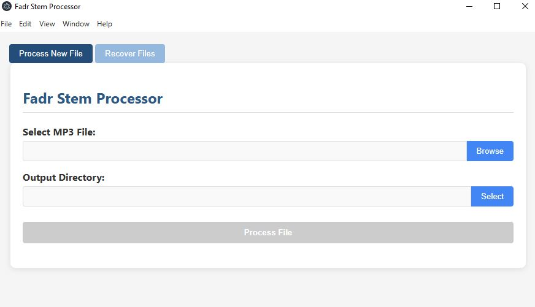

## Project Structure
```
fadr-proj/
├── .vscode/             # VS Code settings
├── src/
│   ├── main.js          # Electron main process
│   ├── renderer.js      # Frontend JavaScript
│   ├── preload.js       # Preload script for secure IPC
│   ├── fadrApi.js       # Fadr API functionality
|   |── processHandler.js # Process file tab
|   └── recoverHandler.js # Recover files tab
├── static/
│   ├── index.html       # GUI HTML
│   └── styles.css       # CSS for the GUI
├── package.json         # Project configuration
└── .env                 # Environment variables
```

## Usage
1. Get API key from https://api.fadr.com. You need to subscribe to the Fadr API at least $10/mth.
2. Create a `.env` file in the root directory with the following content:
```
# .env
FADR_API_KEY=your-api-key
API_URL=https://api.fadr.com
```
3. Run `npm install` to install dependencies.
4. Run `npm start` to start the app.

## GUI 
The GUI is built with Electron and React. It allows you to select an MP3 file, specify an output directory, and process the file. The processed stems and MIDI files will be saved to the specified output directory. 

### Process File Tab


### Recover Files Tab
Sometimes, your process request may not return all of the expected results like your stems or MIDI files. In this case, you can use the Recover Files tab to recover your files if you have the Asset ID. 

To get your Asset ID, you can refer to the generated `metadata.json` file in the output directory.


## License
This project is licensed under the MIT License - see the [LICENSE](LICENSE) file for details. 

